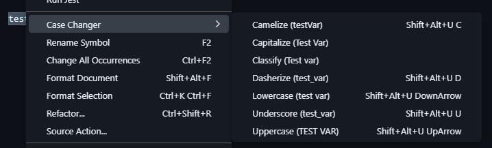

# CaSe_Changer for Visual Studio Code

This extension transforms the selected text case.

## Usage

Ones installed and `vscode` reloaded you will be able to use the set of keybindings for transforming selected text.

Also there is a context menu where you are able to select the text transformation

## Transformations

- Uppercase
- Lowercase
- Dasherize
- Camelize
- Classify
- Underscore
- Capitalize

## Extension Settings

No Additional settings
